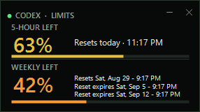

# CodexBar

**A tiny Windows desktop widget for keeping an eye on your 5-hour and weekly Codex limits.**

CodexBar itself requires no login, API key, or account setup—it automatically reuses your existing signed-in Codex session. It shows the percentage remaining and next reset for both the 5-hour and weekly Codex windows, plus the expiration dates and times of every available banked reset. It stays out of the way as a compact, draggable widget and continues updating from the Windows notification area.



## Highlights

- Requires no separate login or API key—automatically reuses your existing Codex authentication
- Shows **5-hour and weekly capacity remaining**, not usage consumed
- Displays both next-reset times in your local date and time
- Lists the exact expiration date and time of every available banked rate-limit reset
- Changes from green to amber to red as capacity runs low
- Refreshes automatically at a configurable interval
- Minimizes to the Windows notification area
- Shows a taskbar button while the widget is visible and removes it when minimized to the tray
- Supports adjustable transparency and always-on-top mode
- Can launch automatically when Windows starts
- Can notify you by email when weekly capacity resets to fully available
- Actively fetches current limits through Codex's supported local app-server interface
- Roughly 250 KB as a framework-dependent Windows executable

## Using the widget

- **Move:** drag anywhere on the widget.
- **Taskbar:** CodexBar appears in the taskbar while its widget is visible.
- **Minimize to tray:** click `—` to hide both the widget and its taskbar button while CodexBar keeps updating in the notification area.
- **Restore:** double-click the CodexBar notification icon, or choose **Show widget** from its menu.
- **Tray menu:** right-click either the widget or its notification icon.
- **Close:** clicking `×` minimizes CodexBar to the tray so it can keep updating.
- **Quit:** choose **Exit** from the tray menu.

Each percentage is the capacity still available in that window. For example, if Codex reports 10% used in the 5-hour window, CodexBar displays **90% left** for that window.

## Settings

Preferences persist between launches.

| Setting | Options | Default | What it does |
|---|---|---:|---|
| Refresh interval | 5 sec, 15 sec, 30 sec, 1 min, 5 min | 15 sec | Controls how often CodexBar requests the current live account limit. |
| Transparency | 100%, 90%, 80%, 70%, 60%, 50% opaque | 90% | Adjusts the entire widget's opacity. |
| Always on top | On / Off | On | Keeps the widget above ordinary windows. |
| Start with Windows | On / Off | Off | Adds or removes CodexBar from the current user's startup applications. |
| Usage notifications | SMTP | On, unconfigured | Sends one alert when observed weekly usage returns to zero and SMTP is configured. |
| Send test alert | — | — | Exercises the configured notification delivery without changing reset tracking. |
| Refresh now | — | — | Requests the current live account limit immediately. |

Preferences are stored at:

```text
%LOCALAPPDATA%\CodexBar\settings.json
```

## Notifications

CodexBar can notify you by email when weekly capacity resets to fully available. Open **Usage notifications…** from the tray menu, enter a notification address and your mail provider's SMTP details, and CodexBar sends one message automatically when it observes the weekly usage return to zero.

You may be able to receive the alert as a text by using an email-to-SMS or email-to-MMS address supplied by your mobile carrier. Ask your carrier or search its official support site for **email-to-text gateway** and your plan name. The address is often based on your full phone number and a carrier-specific domain, but formats and availability vary. Send a normal test email to the address first, then use **Send test alert** in CodexBar.

For Gmail SMTP, use `smtp.gmail.com`, port `587`, enable SSL/TLS, and enter your full Gmail address as the SMTP user. Google requires 2-Step Verification before you can [create a 16-digit app password](https://support.google.com/mail/answer/185833?hl=en); use that app password in CodexBar instead of your normal Google password. The app-password option may be unavailable for some managed, security-key-only, or Advanced Protection accounts.

## How it works

CodexBar uses the authenticated Codex installation already on your computer:

1. Starts Codex's local `app-server` in the background using the installed Codex executable.
2. Calls the supported `account/rateLimits/read` method at the selected refresh interval. Codex owns authentication, token refresh, and the upstream request.
3. Selects the account-wide `codex` limit, ignoring separate model-specific pools.
4. Finds the 5-hour (`300` minutes) and seven-day (`10080` minutes) windows by duration, regardless of whether Codex reports either one as the primary or secondary limit.
5. Displays `100 − used_percent` and the reset time for each window, plus any available banked-reset expirations in your local time zone.

This means CodexBar does not scrape the UI, automate a browser, read authentication tokens directly, or maintain a second login. The default refresh interval is 15 seconds, but you can change it from **Refresh interval** in the tray menu. Each selected interval performs a real authenticated rate-limit read—for example, selecting 5 seconds sends one read every 5 seconds, while selecting 5 minutes sends one every 5 minutes. If a request fails, the widget clearly labels the last successful live value as **Offline** while it retries.

## Privacy and security

- No Codex credentials, access tokens, or API keys are requested or stored.
- Authenticated requests are delegated to the official local Codex app-server; CodexBar never handles the underlying token.
- Only account-wide 5-hour and weekly limit fields are used; conversation content and local session files are never read.
- If SMTP delivery is configured, its address, host, port, and user are stored in the local settings JSON. The SMTP password is protected with Windows Data Protection API for the current Windows user and is never written there as plaintext.

## Installation

### Download a release

Download `CodexBar.exe` from the repository's **Releases** page and run it. The lightweight build requires the [.NET 10 Desktop Runtime](https://dotnet.microsoft.com/en-us/download/dotnet/10.0). A portable release may also be provided for computers without .NET installed.

Windows may show a SmartScreen warning for unsigned community-built executables. Choose **More info → Run anyway** only if you downloaded the file from a release you trust.

### Build it yourself

Requirements:

- Windows 10 or Windows 11, x64 or ARM64
- .NET 10 SDK or newer
- Codex app or CLI used at least once

Clone the repository using GitHub's **Code** button, then from PowerShell:

```powershell
cd codex-bar
.\build.ps1
```

The lightweight executable is written to `dist\CodexBar.exe`.

To bundle the .NET runtime into a larger, standalone executable:

```powershell
.\build.ps1 -Portable
```

For Windows on ARM:

```powershell
.\build.ps1 -Runtime win-arm64
```

### Run regression checks

The parser checks use a zero-dependency console harness, so run the repository test entry point instead of `dotnet test`:

```powershell
.\test.ps1
```

## Troubleshooting

### “Open Codex and sign in”

Open Codex and sign in. CodexBar will reuse that authenticated session on its next refresh. The installed Codex version must support app-server account methods.

### The number has not changed

Choose **Refresh now** to request the live limit immediately. If the widget says **Offline**, open or update Codex and confirm that you are signed in; live access will be retried automatically.

### The widget disappeared

Look for the CodexBar icon in the notification area, including the overflow menu, and double-click it. Only **Exit** fully closes the application.

### The lightweight EXE asks for .NET

Install the [.NET 10 Desktop Runtime](https://dotnet.microsoft.com/en-us/download/dotnet/10.0), or rebuild/download the portable version.

## Project structure

```text
CodexBar.csproj    Windows Forms project configuration
WidgetForm.cs      Widget UI, tray menu, rendering, and refresh behavior
CodexAppServerClient.cs  Live authenticated Codex rate-limit client
UsageRateParser.cs       Account-wide 5-hour and weekly window parser
AppSettings.cs     Persistent preferences and Windows startup setting
build.ps1          Lightweight and portable publishing script
test.ps1           Zero-dependency parser regression checks
CHANGELOG.md        Version history and release notes
assets/            Product screenshots
                    Multi-resolution Windows application icon
```

## Limitations

- Windows only.
- The lightweight build depends on the .NET 10 Desktop Runtime.
- It reports the account-wide 5-hour and weekly Codex pools, not separate model-specific limits.
- If Codex does not return a 5-hour window for an account, the widget labels that row as unavailable while continuing to display the weekly window.
